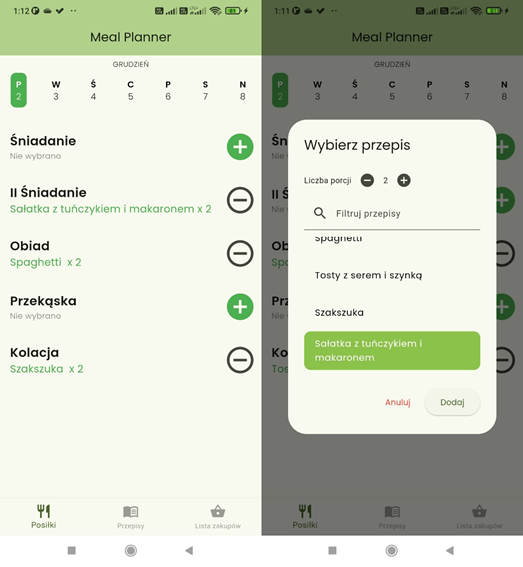
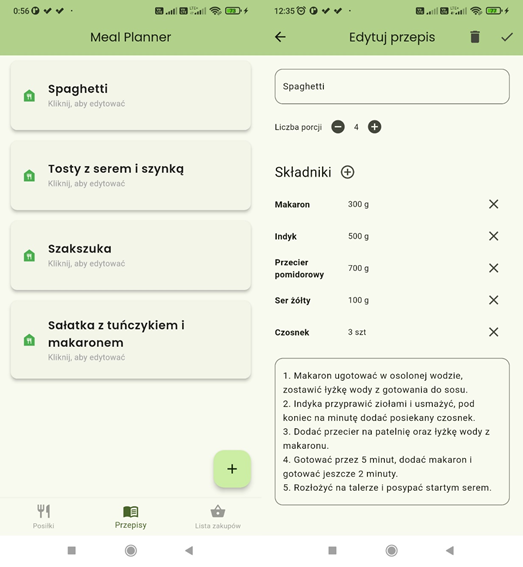
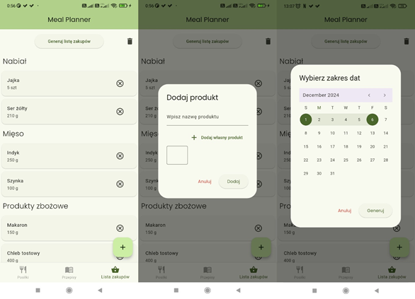

# Meal Planner

Meal Planner is a mobile application, designed for meal planning and generating shopping lists. It enables efficient management of recipes, meals, and shopping, supporting a healthy and organized lifestyle.

## Features

- **Meal Planning**: Set up a meal plan for a selected day.
- **Recipe Management**: Add, edit, and delete recipes.
- **Shopping List Generation**: Automatically create shopping lists based on your meal plan.
- **User-Friendly Interface**: Simple and intuitive interface.

## Technologies

- **Flutter**: Framework for building mobile applications.
- **Drift**: Library for managing local databases.
- **SQLite**: Local database for storing application data.

## Installation

1. Clone the repository:
   ```bash
   git clone https://github.com/KrystianOchmanski/meal_planner
   ```
2. Navigate to the project directory:
   ```bash
   cd meal_planner
   ```
3. Install dependencies:
   ```bash
   flutter pub get
   ```
4. Run the application on an emulator or physical device:
   ```bash
   flutter run
   ```

## Project Structure

- **lib/**: Main directory containing the application code.
  - **data/**: Data models and database management.
  - **screens/**: Application screens.
  - **widgets/**: Reusable widgets used in the application.

## Example Screenshots

### Meal Planning Screen


### Recipe Screen


### Shopping List Screen


### Author

This project was created as part of an engineering thesis: **"Design and implementation of an original meal planning application with a shopping list generation function."**

